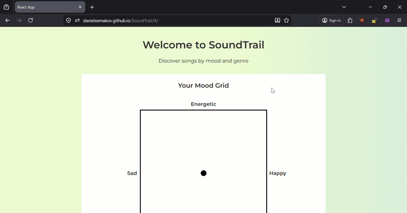

# SoundTrail 
  
SoundTrail is a full-stack web application that generates personalized Spotify playlists based on your current mood and genre preferences. Instead of searching for songs or artists, you simply click a point on an interactive mood grid and let SoundTrail do the rest.

## Website Link
 
[danielsemakov.github.io/SoundTrail](https://danielsemakov.github.io/SoundTrail) 

## Demo

 
## Features
 
- **Interactive Mood Grid**: Click anywhere on a 2D energy/valence chart to express your current mood
- **Real-Time Playlist Generation**: Instantly generates a Spotify playlist tailored to your mood and genre selection from a dataset of 30,000+ songs
- **Genre Selection**: Filter recommendations across six different genres (or combine all genres)
- **Spotify Integration**: Open your generated playlist directly in Spotify with one click
 
## Tech Stack
 
| Category | Technology |
|---|---|
| Frontend | JavaScript, React, CSS Modules |
| Backend | JavaScript, Node.js, Express |
| APIs | Spotify Web API |
| Testing | React Testing Library  |
| Deployment | GitHub Pages (frontend), Render (backend) |
| Project Management | Taiga |
 
## Team
 
Built by a team of Computer Science students at the University of North Carolina at Charlotte.
 
## License
 
MIT